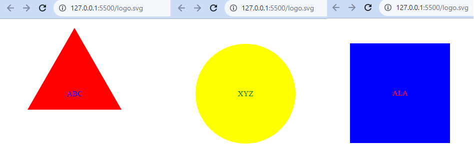

# SVG Logo Generator

# Logo Generator
Generates a readme based on the user inputs

# Carleton University Coding Bootcamp Challenge Assignment 09

## Bootcamp Module 09 Individual Challenge Assignment - SVG Logo Generator

This Command line application will prompt the user with details required to create the logo. User will be requuested for 3 characters and a choice of color for the characters. choice of colors can be submitted either with the color name or with the hexadecimal code. Thereafter the user will be requested for a type shape with a shape color for the logo (Circle, Triangle or Square). Once all information is collected, the application will generate the Logo which will be saved in a SVG file.

## User Acceptance Criteria

* Command-line application that accepts user input
* Prompted the for 3 characters  the Logo.
* Prompted for a text color (Word or by Hexadecimal number).
* Prommp the user to pick a shape for the Logo (Circle, Triangle or Square)
* User can decide on a color for the shape (Color name or Hexadecimal number)
* When all the user information is gathered. A Logo is generated and saved into a SVG file is created named `logo.svg`
* When the file is generated a text "Generated logo.svg" is printed in the command line
* The output logo.svg file can be opened in the browser and the generated logo is displayed on the browser
* Tets scripts were implemented using NPM Jest method.

## Requirements to view the code and the output

- VS Code with node js and NPM package - Inquirer Version 8.2.4.
- OS - MS Windows, MAC or any other OS which supports GUI browser display.

## Usage

Screen layout is available in the repository path: 

## Credits

- Lecturer Gurneesh Singh for teaching us the module.
- Tutor Dru Sanchez for guiding me on the subjected matters.

  
## Features Links

Url for the demo vedio: https://drive.google.com/file/d/131-R8JivoQVOP72eFgjscOnpvXSyz72I/view
Github Repository url: https://github.com/anthogr45/SVG-Logo-Maker
